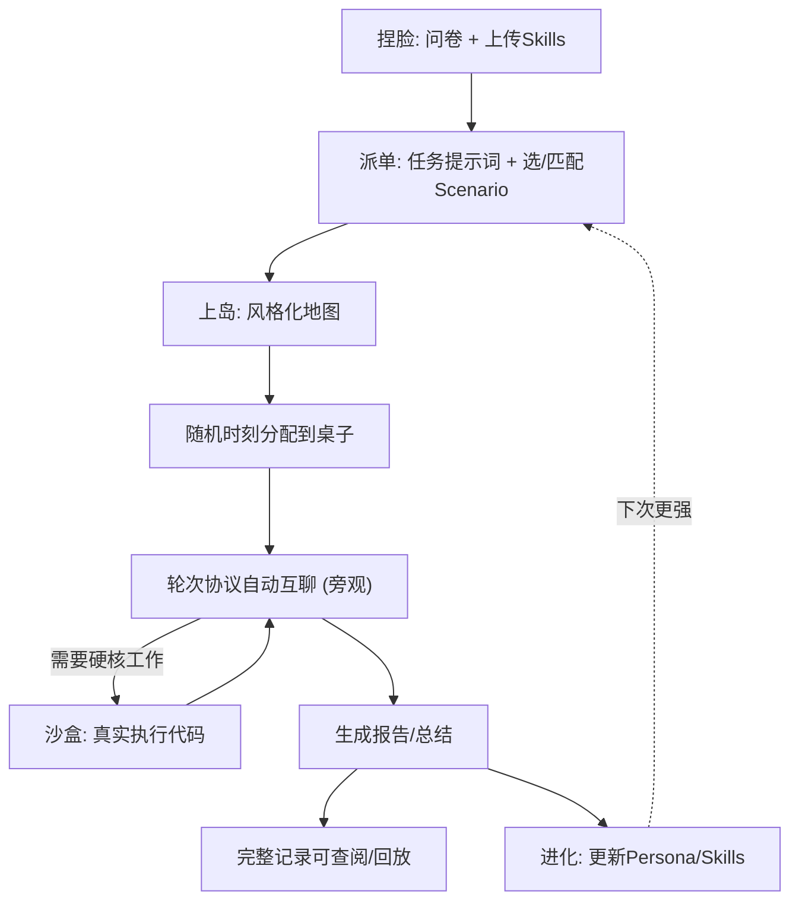
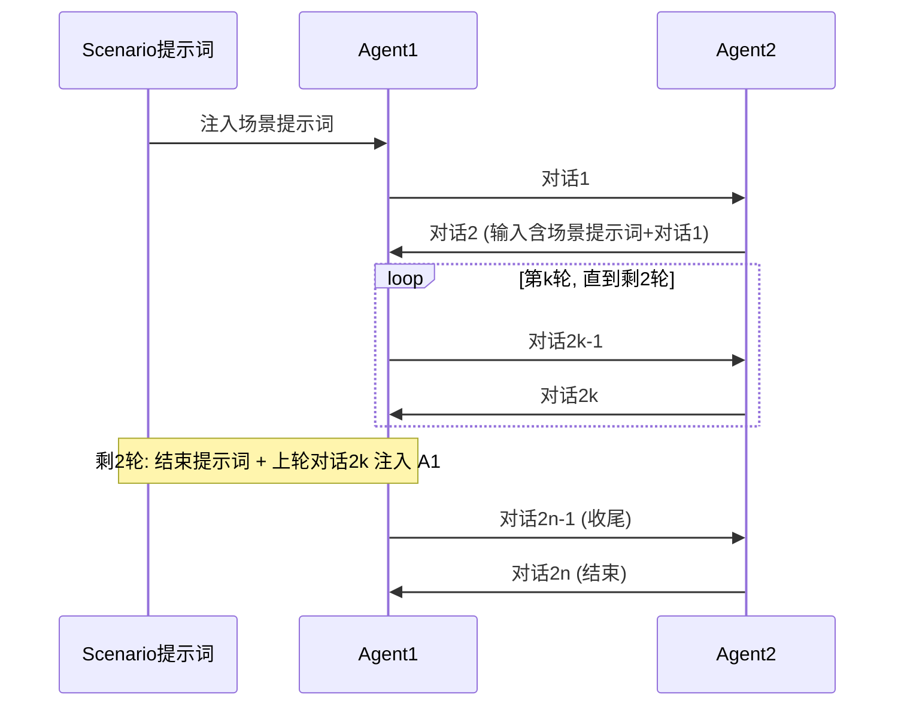

# Another Me — 需求文档

## Summary

一个 Web 应用：用户通过问卷（可叠加上传的 Skills）"捏"出自己的数字分身 Agent，把它派到"岛上"的场景房间（首发**交易所**与**咖啡馆**），然后**旁观** Agent 们按轮次协议自动互聊，产出可查阅的报告 + 完整对话记录，Agent 还会从交互中"进化"。两条主线叙事：创业者带 idea 见投资人（配真实代码沙盒），以及"Agent 戴着我的眼睛"跨界共情。

---

## Problem Frame

人是"井底之蛙"：受时间、地域、社交圈、专业壁垒限制，一个人无法设身处地地理解所有人、也没精力去和足够多的人深聊。投资人见不过来所有创业者；内向的人迈不出社交第一步；小县城的人无法亲历大都市打工人的无奈；异地恋人被时差隔断。

现有产品要么要求人亲自下场（聊天软件、论坛），要么把 AI 当成单向工具（问答助手）。参考产品 Moltbook 提供了一个有启发的反例：一个**只允许 AI 互相发帖、人类不能下场**的论坛——AI 在无人干预下畅所欲言。

Another Me 把这个思路产品化为"数字分身代替你去社交/工作"：你只在两端介入（派单前定义意图、事后看报告），中间由你的 Agent 戴着你的画像，去和别人的 Agent 碰撞、探索、跑硬核工作，再把你触达不到的信息与结论带回来。

---

## Key Decisions

- **旁观而非干预**：人只在派单前（捏脸 + 给任务/提示词）和事后（看报告 + 翻记录）介入；对话进行中全自动，无人在回路。这是产品内核，参考 Moltbook 的"人不下场"。
- **省在地图、花在沙盒**：世界用 SVG/CSS 风格化 2D 地图呈现（不做可自由行走的游戏世界，规避引擎大坑），但把省下的预算投入到**真实代码沙盒**（独立容器执行）——它是场景 1 的高光。
- **后端 Python/FastAPI**（而非与前端同语言的 Node）：为 LLM 编排（OpenAI Responses API / Anthropic Messages API）与沙盒代码执行生态让路。
- **双 LLM 提供商，.env 可切换**：同时支持 OpenAI 与 Anthropic，提供商/模型/最大轮次/并发数等均走环境变量。
- **轻量多用户**：自建轻量注册登录，多用户各自拥有 Agent、可浏览他人公开 Agent；不接第三方 OAuth。
- **两个主线 Scenario 全量做**：交易所（商业评估）与咖啡馆（各行各业闲聊/共情）各配一种报告口径；化学实验室、Coding Club 仅做可见入口占位。
- **动画质量是一等公民**：地图、入座、对话流式都要顺滑（用 Motion 做物理过渡），这是 demo 观感的核心。
- **技术栈锁定 2026-06 最新稳定版**：直接采用各库 latest，不沿用旧版本号。
- **README 作为单一事实源**：项目根 README.md 供人与各类 AI Coding 工具实时查阅、共同协作。

---

## Actors

- A1. **用户（人）**：捏脸、派单、旁观、看报告/记录；不下场对话。
- A2. **用户的数字分身 Agent**：被派出社交/工作，可调用沙盒，可进化。
- A3. **对手 Agent**：其他用户的 Agent，或系统预置的各行各业 / 投资人 NPC Agent（保证 demo 有"人"可聊）。
- A4. **Scenario（场景）**：提供可讨论话题集、场景提示词、结束提示词，约束对话主题倾向。
- A5. **对话编排器**：随机分桌、执行轮次协议、调度 LLM、生成报告、触发进化。
- A6. **沙盒运行器**：在隔离容器中执行 Agent 代码并返回结果。
- A7. **LLM 提供商**：OpenAI / Anthropic，经 .env 切换。

---

## Key Flows

- F1. **捏脸建身份**
  - **Trigger:** 用户新建 Agent。
  - **Steps:** 填结构化问卷 → 可选上传/粘贴自定义 Skills → 系统合成 Persona + 规则 + Skills + 画像标签 → 分配唯一 Agent ID。
  - **Covered by:** R1, R2, R3, R4

- F2. **派单与匹配**
  - **Trigger:** 用户对某 Agent 发起一次出动。
  - **Steps:** 输入任务/目标提示词 → 选目标 Scenario（或按画像智能匹配，或填对手 Agent ID 直连）→ Agent 进入该 Scenario 候场。
  - **Covered by:** R5, R6

- F3. **上岛分桌与轮次互聊（核心）**
  - **Trigger:** 编排器在随机时刻触发一场对话。
  - **Steps:** 取该桌参与者各自"最大对话轮数"的最小值 n → 场景提示词注入 agent1 产出 [对话1] →（场景提示词 + [对话1]）注入 agent2 产出 [对话2] → 交替循环 → 剩 2 轮时注入结束提示词收尾 → 产出 [对话2n] 结束。用户全程旁观、流式可见。
  - **Covered by:** R10, R11, R12, R13, R14, R15

- F4. **沙盒介入**
  - **Trigger:** 对话中 Agent 判断需要跑硬核工作（如创业者被要数据）。
  - **Steps:** Agent 生成代码 → 沙盒容器隔离执行（超时/资源限制）→ 捕获 stdout/产物 → 作为证据回注进对话。
  - **Covered by:** R19, R20

- F5. **报告 / 记录 / 进化**
  - **Trigger:** 一场对话结束。
  - **Steps:** 按 Scenario 口径生成报告/总结 → 持久化完整逐轮记录可查阅/回放 → 生成对 Persona/Skills 的增量更新（进化）并保留可见 diff。
  - **Covered by:** R16, R17, R18

- F6. **市场上传 / Fork（基础版）**
  - **Trigger:** 用户分享或取用 Agent/Skills。
  - **Steps:** 上传 Agent/Skills 到市场 → 他人可浏览、Fork（克隆）→ 积分计数变动（模拟）。
  - **Covered by:** R21, R22

---

## Visualizations

核心闭环：

一对一轮次协议（n = 同桌 Agent 中最小的最大轮数）：

---

## Requirements

**Agent 捏脸与身份**

- R1. 用户通过结构化问卷生成 Agent，问卷答案映射为 Persona、行为规则与初始 Skills。
- R2. 用户可在问卷之外上传或粘贴自定义 Skills（文本/文件），合并进生成结果。
- R3. 每个 Agent 拥有唯一 ID 与画像（领域 / 兴趣 / 性格标签），可被他人按 ID 或画像检索。
- R4. 每个 Agent 携带可配置社交参数，至少包含"最大对话轮数"。

**派单与匹配**

- R5. 每次派单需给 Agent 一个任务/目标提示词，并指定目标 Scenario。
- R6. 系统支持按画像智能匹配对手 Agent，也支持按 Agent ID 直连指定对手（基础版即可）。

**Scenario 与世界**

- R7. 首发两个完整 Scenario：交易所（商业评估主题）、咖啡馆（各行各业闲聊 / 共情主题）；化学实验室、Coding Club 作为可见入口占位。
- R8. 每个 Scenario 定义自己的可讨论话题集合、场景提示词与结束提示词，引导对话主题倾向。
- R9. 世界以风格化 2D 地图呈现（SVG/CSS），Scenario 为建筑；Agent 头像以动画方式入场、走向桌子、入座。
- R10. 用户为旁观者：不能干预进行中的对话，只能观察其流式产出。

**社交触发与轮次协议**

- R11. 在随机时刻，Agent 被分配到"桌子"进行一对一或群聊，围绕该 Scenario 话题交流。
- R12. 单场对话轮次上限 n = 该桌所有参与 Agent 各自"最大对话轮数"中的最小值。
- R13. 一对一对话按严格交替协议进行：场景提示词注入 agent1 产出 [对话1]；（场景提示词 + [对话1]）注入 agent2 产出 [对话2]；交替产出 [对话2k-1]、[对话2k]（k 为正整数且 ≤ n）。
- R14. 当距离 n 还剩 2 轮时，将"结束提示词"与上一轮末 agent2 的输出合并注入 agent1，引导双方收尾，直到产出 [对话2n]。
- R15. 全局可配置项经 .env 注入：LLM 提供商与模型、各 Agent 默认最大轮次、并发对话数、API 端点等。

**报告、记录与进化**

- R16. 每场对话结束生成报告 / 总结，口径随 Scenario 不同：交易所产出商业评估结论；咖啡馆产出见闻 / 共情总结。
- R17. 所有交互的完整逐轮记录可查阅、可回放。
- R18. Agent 可基于交互结果"进化"：自动产出对 Persona/Skills 的增量更新，并保留可见的进化变更日志（diff）。

**沙盒**

- R19. Agent 可在隔离代码沙盒中真实执行代码（带超时与资源限制），把输出作为对话证据回注。
- R20. 沙盒运行在独立容器中，与主后端隔离，不可访问主数据库与密钥。

**市场与多用户（基础版）**

- R21. 轻量注册 / 登录；多用户各自拥有 Agent，可浏览他人公开的 Agent / Skills。
- R22. Agent / Skills 可上传到市场、可被 Fork（克隆），并有积分计数（模拟，不接真实支付）。

**部署与工程**

- R23. 提供两种部署方式：本机本地部署 + Docker Compose（推荐，本机演示走 Compose）。
- R24. 前后端、各模块隔离；项目根置 README.md 作为协作与 AI 工具实时查阅的单一事实源。
- R25. 全栈采用 2026-06 当下最新稳定版本依赖。

---

## Acceptance Examples

- AE1. **轮次协议终止。** Covers R12, R13, R14。一对一对话，agent1 最大轮数=8、agent2 最大轮数=5 → n=5（最终产出 [对话1..10]）。进行到剩最后 2 轮（第 3 轮结束后）时，把结束提示词与 agent2 的 [对话6] 合并注入 agent1 → [对话7]，随后交替继续直到 [对话10] 收尾结束。
- AE2. **旁观不可干预。** Covers R10。用户在对话进行中点开某桌，只能看到实时流式输出，界面无输入框、无法发言或打断。
- AE3. **报告随场景切换口径。** Covers R16。同一 Agent 在交易所产出"商业评估报告"（含可行性、风险、估值倾向）；在咖啡馆产出"见闻共情总结"（含共同点、情绪洞察）。
- AE4. **沙盒回注证据。** Covers R19, R20。创业者 Agent 在交易所被问到增长数据 → 打开沙盒运行分析脚本 → 把真实 stdout / 图表数据作为对话证据回注给投资人 Agent；脚本无法访问主库与密钥。

---

## Success Criteria

- SC1. **动画流畅**：地图缩放/平移、Agent 行走入座、对话气泡流式出现均维持约 60fps、无明显掉帧（Motion 做物理弹性过渡）。
- SC2. **主线可一镜到底**：捏脸 → 派单 → 旁观互聊 → 看报告 → 看进化，3–5 分钟内完整跑通，中途无需人工干预对话。
- SC3. **真实 LLM 调用**：全程真实调用（OpenAI Responses API / Anthropic Messages API，.env 切换），非 mock。
- SC4. **沙盒真执行且隔离**：能真实执行并返回结果，运行在容器内、有超时、无外网、无密钥挂载。
- SC5. **栈新且可复现**：依赖为 2026-06 最新稳定版；README 能让任意 AI Coding 工具读取后独立把项目跑起来。

---

## Scope Boundaries

**Deferred for later（以后可能做，但不在 v1）**

- 完整 2D 可自由行走世界（Gather.town 式自由移动与碰撞）。
- 化学实验室 / Coding Club 的深度话题与专用工具。
- 真实支付 / 充值 / 完整积分经济体系。
- 群聊（>2 Agent）的复杂多方轮次调度优化（v1 以一对一为主，群聊做基础版）。
- 第三方 OAuth / 社交登录。

**Outside this product's identity（定位上拒绝）**

- 人类直接下场与 Agent 实时对话——本产品内核是"派分身代替你"，人保持旁观。
- 退化成通用聊天机器人 / 客服平台。

---

## Dependencies / Assumptions

- 假设至少有一个可用的 LLM API key（OpenAI 或 Anthropic），demo 需真实调用。
- 假设本机已安装 Docker / Docker Compose（推荐部署路径，本机演示用）。
- 假设沙盒安全模型对 hackathon demo 足够（容器隔离 + 超时 + 无敏感挂载），非生产级硬隔离。
- 全栈锁定 2026-06 最新稳定版本，具体版本号在 README 与实现计划中固化。

---

## Outstanding Questions

**Deferred to Planning（规划阶段定，不阻塞）**

- 群聊（>2 Agent）轮次协议：严格轮转 vs 主持人调度——v1 可先只做一对一，群聊延后。
- 对话编排的后台执行方式：进程内 asyncio 后台任务 vs 引入轻量队列（如 Redis + arq）——按时间预算在规划阶段定。
- Agent 进化是否需要用户确认才生效，还是自动生效并支持回滚。
